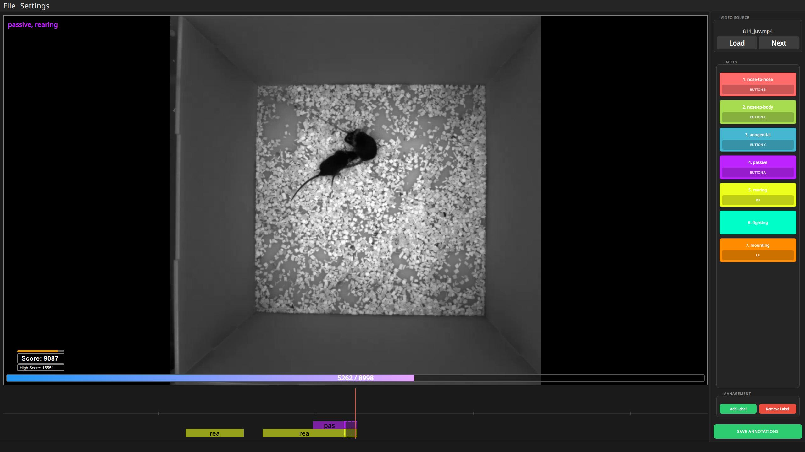

# Ethoscore : Video Behavior Annotator

Ethoscore is a video annotation tool for behavioral analysis, built with PySide6 and OpenCV. Annotate video footage with specific behaviors using keyboard, mouse, and gamepad controls.



## Features

- **Multi-Input Support**: Keyboard shortcuts, mouse, and gamepad controls to keep muscle cramps away
- **Timeline Interface**: Interactive timeline with zoom/click/drag navigation
- **Behavior Annotation**: Label frames with customizable behaviors
- **Optional Gamification**: Get points according to the duration of the labels and even combos if executed quickly!
- **Auto-Save**: Configurable automatic saving
- **Color-Coded Labels**: Visual behavior identification in the timeline and preview bars for previous/next frame
- **CSV Export**: Classic frame by frame matrix

## Installation

**Prerequisites**: Python 3.8+, pip

**Install dependencies**:
```bash
pip install -r requirements.txt
```

**Run**:
```bash
python ethoscore.py
```

## Usage

1. Launch the application
2. Select a video file (MP4, AVI, MOV, MKV, WMV)
3. Label frames using behavior buttons or keyboard shortcuts
4. Navigate with arrow keys or gamepad
5. Annotations auto-save as CSV files

### Controls
- **Arrow Keys**: Navigate frames
- **Shift + Arrows**: Jump larger increments (configurable)
- **Number Keys**: Toggle behaviors
- **Escape**: Remove labels
- **Ctrl+S**: Save
- **Ctrl+O**: Load video
- **Ctrl+N**: Load next video

### Gamepad
- **Left Analog Stick**: Frame navigation
- **Buttons**: Mappable to behaviors, erasing them, or increasing navigation speed

### Settings
- **Input Settings**: Keyboard shortcuts and controller mappings
- **General Settings**: Auto-save, UI preferences

## Data Format

Annotations saved as CSV with video filename. Here is a simple example:
```
Frames,nose-to-nose,nose-to-body,anogenital,passive,rearing,fighting,mounting
1,0,0,0,0,0,0,0
2,1,0,0,0,0,0,0
...
```

- **Frames**: 1-based frame numbers
- **Behavior Columns**: Binary indicators (1=present, 0=absent)

## Roadmap

- Multi behavior on the same frame support
- Enhanced caching for large videos
